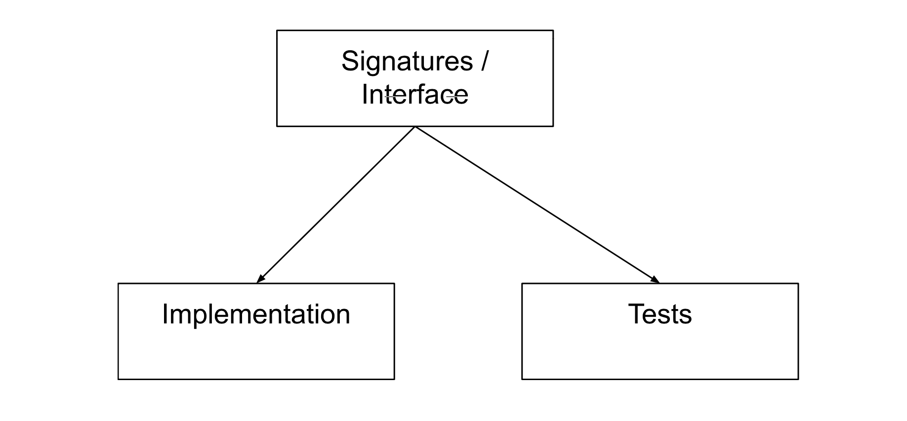

# Built-time AI Code Generation from API

This repository contains a Python application that utilizes AI models to generate code based on instructions received through an API URL. The application processes the instructions, runs the relevant AI models, and returns the generated code as a response.

## Project Architecture

The project architecture is designed as a two-tier system. The first tier (current repo) handles the request processing, interacts with the API, and triggers the AI models. The second tier hosts AI inference and utilises the received preprocessed data to execute an AI model inference. The architecture diagram below provides an overview of the system:



## Installation

To set up the project and ensure proper functionality, follow these steps:

1. Clone the repository to your local machine:

   ```bash
   git clone https://github.com/OpenFn/gen.git
   ```

2. Copy the example env and set your API keys as required:

   ```bash
   cp ./services/inference/.env.example ./services/inference/.env
   ```

3. Navigate to the desired module's directory:

   ```bash
   cd services/<module>
   ```

4. Install the required dependencies using Poetry:

   ```bash
   poetry install
   ```

Repeat these steps for each module under the `services` directory that you want to use.

## Usage

## Starting Services

You can initiate each service using the following steps:

1. Navigate to the desired service module:

   ```bash
   cd services/<module>
   ```

2. Run the service using Poetry:

   ```bash
   poetry run ./run.sh
   ```

Additionally, each module includes a `demo.py` file that can be executed. To run the entire flow:

1. Navigate to the `services` directory:

   ```bash
   cd services/<module>
   ```

2. Run the demo:

   ```bash
   poetry run python demo.py
   ```

To execute the entire process and handle requests from the specified OpenAPI spec and instructions, employing AI models for both signature and code generation, and delivering the generated code as a response, run the following command:

```bash
cd services/
poetry run python demo.py
```

## Project Structure

The project structure is organized as follows:

- `app/`: Contains the main logic and application entry point.
- `utils/`: Directory containing utility functions and helper modules for processing instructions and generating code.
- `tests/`: Directory containing test files for the application.

## API Documentation

The application's API is documented using OpenAPI. View the API documentation at the following URL:

[API Documentation](https://yourapidocumentationurl.com)

## Contributing

Contributions to this project are welcome. Feel free to open issues or submit pull requests for improvements, bug fixes, or new features.

## License

This project is licensed under the MIT License - see the [LICENSE](LICENSE) file for details.

---

TBD: the placeholders are to be replaces with actual links, instructions, and details relevant to the project.
