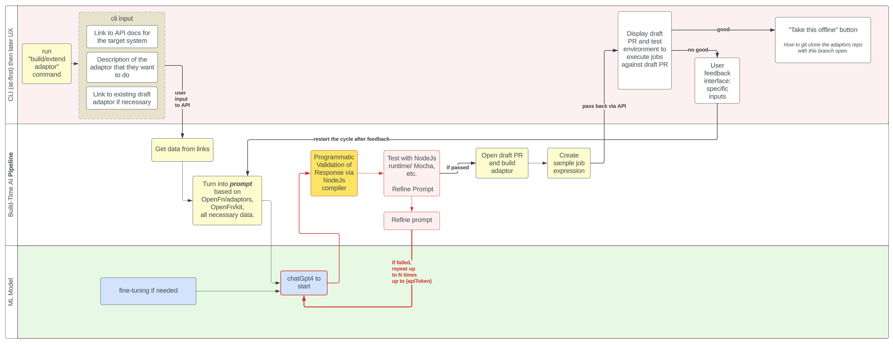

# Built-time AI Code Generation from API

This repository contains a Python application that utilizes AI models to generate code based on instructions received through an API URL. The application processes the instructions, runs the relevant AI models, and returns the generated code as a response. 

## Project Architecture

The project architecture is designed as a two-tier system. The first tier (current repo) handles the request processing, interacts with the API, and triggers the AI models. The second tier hosts AI inference and utilises the received preprocessed data to execute an AI model inference. The architecture diagram below provides an overview of the system:




## Installation

1. Clone the repository to your local machine:

   ```bash
   git clone https://github.com/OpenFn/gen.git
   ```

2. Navigate to the project directory:

   ```bash
   cd ai-code-generation
   ```

3. Install the required dependencies using Poetry:

   ```bash
   poetry install
   ```

## Usage

Run the main application using the following command:

```bash
poetry run python main.py
```

The application will start processing requests from the specified API URL, utilize the AI models for code generation, and provide the generated code as a response.

## Project Structure

The project structure is organized as follows:

- `app/`: Contains the main logic and application entry point.
- `utils/`: Directory containing utility functions and helper modules for processing instructions and generating code.
- `tests/`: Directory containing test files for the application.

## API Documentation

The application's API is documented using OpenAPI. View the API documentation at the following URL:

[API Documentation](https://yourapidocumentationurl.com)

## Contributing

Contributions to this project are welcome. Feel free to open issues or submit pull requests for improvements, bug fixes, or new features.

## License

This project is licensed under the MIT License - see the [LICENSE](LICENSE) file for details.

---

TBD: the placeholders are to be replaces with actual links, instructions, and details relevant to the project.
